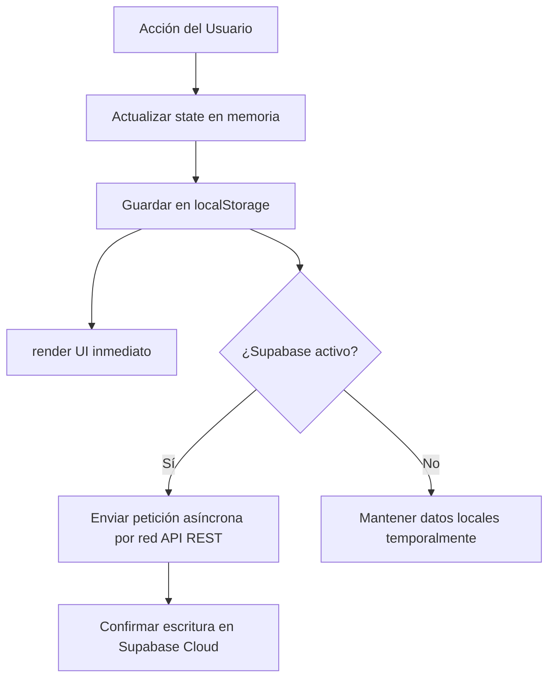

# Manual Técnico Completo · Arquitectura del Sistema
## Proyecto: Reserva de Libros del Colegio San Buenaventura

Este documento detalla el diseño técnico, la arquitectura de datos, el flujo de sincronización y las dependencias del sistema de reserva de libros del Colegio San Buenaventura. Está dirigido a administradores de sistemas, desarrolladores de software y personal técnico de mantenimiento.

---

## 1. Arquitectura de la Aplicación
La plataforma está diseñada como una **SPA (Single Page Application)** construida bajo una filosofía de minimalismo tecnológico y alto rendimiento:

* **Frontend**: HTML5 Semántico, CSS3 Vanilla (variables de diseño, flexbox, grid, animaciones de microinteracción) y Javascript Vanilla (ES6+, programación asíncrona y reactividad manual por manipulación directa del DOM).
* **Ausencia de Frameworks**: No utiliza React, Vue ni Angular, eliminando la necesidad de empaquetadores complejos (`webpack`, `vite`, `turbopack`) y garantizando un tiempo de carga instantáneo.
* **Paradigma de Renderizado**: Reactividad centralizada. Toda la aplicación se maneja a través de un objeto global `state` en memoria. Al realizar cambios en el estado, se invoca la función central `render()`, que recompone el DOM necesario y lo inserta en `#app-root`.

---

## 2. Estrategia de Persistencia: Offline-First
La aplicación implementa una estrategia híbrida de almacenamiento que garantiza robustez frente a caídas de red:



* **LocalStorage**: Actúa como base de datos local de lectura inmediata. Al abrir la página, el portal carga los datos almacenados localmente para pintar la interfaz al instante.
* **Supabase Cloud**: Si la conexión con Supabase está disponible, se realiza una sincronización en segundo plano (`syncFromSupabase()`) que sobreescribe el caché local con la información más reciente de la nube.
* **Escritura Asíncrona**: Al guardar una reserva, actualizar un libro o enviar un email, se actualiza localmente y se lanza una promesa asíncrona no bloqueante hacia Supabase. Si la conexión falla, los datos permanecen seguros en el navegador del administrador o usuario.

---

## 3. Esquema de Base de Datos en Supabase
El backend utiliza una base de datos PostgreSQL alojada en Supabase (`https://wcrfbhbgbhmpytbwfqlx.supabase.co`). El esquema consta de 4 tablas principales:

### 3.1. Tabla `settings` (Configuración del Centro)
Almacena los parámetros globales de funcionamiento.
* `id` (int8, Primary Key): ID único, siempre valor `1`.
* `school_name` (text): Nombre del centro (ej. `Colegio San Buenaventura`).
* `school_year` (text): Año académico activo (ej. `2026/2027`).
* `deadline_date` (text): Fecha límite de reservas (formato `YYYY-MM-DD`).
* `contact_email` (text): Correo de contacto principal.
* `contact_phone` (text): Teléfono de contacto principal.
* `custom_receipt_message` (text): Mensaje personalizado en el pie de los PDFs.

### 3.2. Tabla `books` (Catálogo de Libros)
Almacena el catálogo ofertado.
* `id` (text, Primary Key): ID interno del libro (ej: `inf3-1`).
* `title` (text): Nombre del libro.
* `subject` (text): Asignatura correspondiente.
* `grade` (text): Curso aplicable.
* `price` (numeric): Importe económico del libro.
* `publisher` (text): Editorial de publicación.
* `required` (bool): Define si es obligatorio en el curso (`true` = obligatorio, `false` = opcional).

### 3.3. Tabla `reservations` (Historial de Reservas)
Almacena los pedidos realizados por las familias.
* `id` (text, Primary Key): Código de reserva familiar (ej: `RES-2026-001`).
* `student_name` (text): Nombre del alumno o alumnos concatenados (para compatibilidad).
* `student_grade` (text): Cursos involucrados concatenados.
* `parent_name` (text): Nombre completo del tutor.
* `parent_email` (text): Correo de contacto del tutor (clave para la autoconsulta).
* `parent_phone` (text): Teléfono de contacto.
* `books` (jsonb): Array con los IDs de los libros reservados.
* `students` (jsonb): Estructura detallada por alumno con sus respectivos libros asignados (ej. `[{ studentName: "...", studentGrade: "...", books: [...], subtotal: 0.0 }]`).
* `total` (numeric): Importe total consolidado del pedido.
* `status` (text): Estado de preparación de la reserva (`Pendiente`, `Confirmado`, `Preparado`, `Entregado`, `Cancelado`).
* `created_at` (timestamptz): Fecha y hora de creación de la reserva.

### 3.4. Tabla `emails` (Historial de Comunicaciones)
Buzón simulado de auditoría de notificaciones enviadas.
* `id` (uuid, Primary Key): Identificador único autogenerado.
* `to_email` (text): Destinatario del correo.
* `subject` (text): Asunto del email.
* `body` (text): Cuerpo completo en formato texto plano.
* `sent_at` (timestamptz): Marca de tiempo del envío virtual.

---

## 4. Integración y Lógica de Chart.js
Para las analíticas en tiempo real en la vista de administración, la aplicación utiliza la librería de gráficos **Chart.js v4** a través de CDN.

### Ciclo de Vida y Evitación de Conflictos de Instancias
El motor de renderizado de la SPA redibuja por completo el HTML del panel administrativo cada vez que cambia el estado o la pestaña activa. Si se intenta inicializar un gráfico sobre un canvas que ya tiene una instancia previa de Chart.js vinculada, la librería lanzará un error crítico de ejecución.

Para solucionar esto, se implementa el siguiente flujo en `app.js`:
1. **Contenedor Global**: Las instancias activas se almacenan en un objeto global accesible en `window.myCharts = {}`.
2. **Función de Inicialización (`initInteractiveCharts`)**:
   - Comprueba si existen objetos de gráfico en `window.myCharts.chartTrend`, `window.myCharts.chartStatus` o `window.myCharts.chartPublishers`.
   - Si existen, invoca el método nativo `.destroy()` en cada uno de ellos y limpia la referencia a `null`.
   - Instancia los nuevos gráficos en los elementos canvas correspondientes del DOM actual.
3. **Hook en Renderizado**: La función `render()` ejecuta `initInteractiveCharts()` de manera asíncrona inmediata dentro de un bloque `setTimeout(..., 0)` únicamente cuando el usuario navega a la pestaña de "Dashboard", garantizando que el navegador ya haya cargado los elementos canvas en el DOM antes de que la librería intente dibujar sobre ellos.

### Adaptación a Temas Oscuro y Claro (Dynamic Themes)
Chart.js dibuja directamente en mapas de bits bidimensionales (canvas 2D), por lo que no puede resolver variables CSS de manera automática al cambiar el tema del navegador. Para solventarlo:
* Al arrancar `initInteractiveCharts()`, se leen los colores computados de la página mediante:
  `const computedStyle = getComputedStyle(document.body);`
* Se extraen los valores de `--text`, `--text-muted`, `--border` y `--font-body`.
* Se inyectan estas cadenas de color como variables de configuración en los ejes (`scales.x.ticks.color`), cuadrículas (`scales.y.grid.color`) y leyendas de Chart.js.
* Al pulsar el botón de cambio de tema, la función `toggleTheme()` cambia la propiedad `data-theme` y llama a `render()`, lo que destruye los gráficos y los vuelve a renderizar con las nuevas propiedades CSS computadas del modo seleccionado, logrando una perfecta adaptación de colores.

---

## 5. Script de Compilación (`sync.py`)
Para simplificar la distribución y permitir el funcionamiento en local y previsualización rápida sin configurar servidores web ni dependencias de archivos, se incluye el script compilador `sync.py` desarrollado en Python 3:

* **Objetivo**: Leer los archivos fuente de producción del directorio de trabajo (`styles.css` y `app.js`).
* **Compilación**: Lee el archivo plantilla HTML base de la SPA e inyecta dinámicamente el contenido completo de `styles.css` en una etiqueta `<style>` y el código de `app.js` en una etiqueta `<script>` unificada.
* **Output**: Genera un único archivo consolidado autoejecutable en el directorio padre denominado `previsualizacion-san-buenaventura.html`.
* **Ejecución**: Para compilar manualmente tras realizar un cambio de desarrollo, ejecute:
  ```bash
  python3 sync.py
  ```

---

## 6. Configuración de Despliegue (GitHub + Vercel)
El proyecto está integrado con la plataforma **Vercel** para su distribución en producción bajo un pipeline de Integración y Despliegue Continuo (CI/CD):
* **Rama Principal**: `main`
* **Trigger**: Cada vez que se realiza un commit y push a la rama `main` en GitHub, Vercel detecta la actualización de forma automática, compila los assets estáticos y actualiza el CDN global de producción.
* **Repositorio de Referencia**: `https://github.com/josemanuelsantos-svg/school-book-reservations`
* **Despliegue a Producción**: El dominio principal del proyecto redirige al hosting estático y seguro servido por Vercel.
* **Estructura Estática**: El servidor web únicamente sirve `index.html`, `styles.css`, `app.js` y el logotipo `csblogo.png` como recursos públicos estáticos, descargando todo el procesamiento lúdico en el navegador del cliente final (Edge Computing / Client-Side Rendering).
